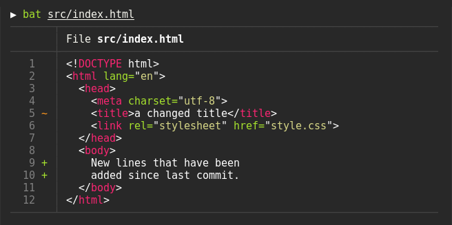

# bat

> **[bat](https://github.com/sharkdp/bat) - 增强版 cat 工具(带有 git 集成和语法高亮)**

- **语法高亮**
- **Git 集成**
- **不可打印字符可视化**
- **自动分页**
- **智能输出(支持管道符)**



```bash
# 安装对应工具(Ubuntu)
$ sudo apt install bat
$ mkdir -p ~/.local/bin
$ ln -s /usr/bin/batcat ~/.local/bin/batcat

# 安装对应工具(macOS)
$ brew install bat
```

```bash
# 获取帮助信息
$ ➜ bat --help
bat 0.18.3
A cat(1) clone with syntax highlighting and Git integration.

USAGE:
    bat [OPTIONS] [FILE]...
    bat <SUBCOMMAND>

OPTIONS:
    -A, --show-all
            Show non-printable characters like space, tab or newline.
    -p, --plain
            Only show plain style, no decorations.
    -l, --language <language>
            Explicitly set the language for syntax highlighting.
    -H, --highlight-line <N:M>...
            Highlight the specified line ranges with a different background color For example.
    -d, --diff
            Only show lines that have been added/removed/modified with respect to the Git index.
    -n, --number
            Only show line numbers, no other decorations.
    -f, --force-colorization
            Alias for '--decorations=always --color=always'.
    -m, --map-syntax <glob:syntax>...
            Map a glob pattern to an existing syntax name.
    -r, --line-range <N:M>...
            Only print the specified range of lines for each file.
    -L, --list-languages
            Display a list of supported languages for syntax highlighting.
    -u, --unbuffered
            This option exists for POSIX-compliance reasons ('u' is for 'unbuffered').
    -h, --help
            Print this help message.
    -V, --version
            Show version information.
```

```bash
# 在终端中查看一个文件
> bat README.md

# 一次性展示多个文件
> bat src/*.rs

# 从stdin读入流并自动为内容添加语法高亮
> curl -s https://sh.rustup.rs | bat
> yaml2json .travis.yml | json_pp | bat -l json
> tail -f /var/log/pacman.log | bat --paging=never -l log
> git show v0.6.0:src/main.rs | bat -l rs
> git diff --name-only --diff-filter=d | xargs bat --diff

# 显示不可打印字符
> bat -A /etc/hosts
```
