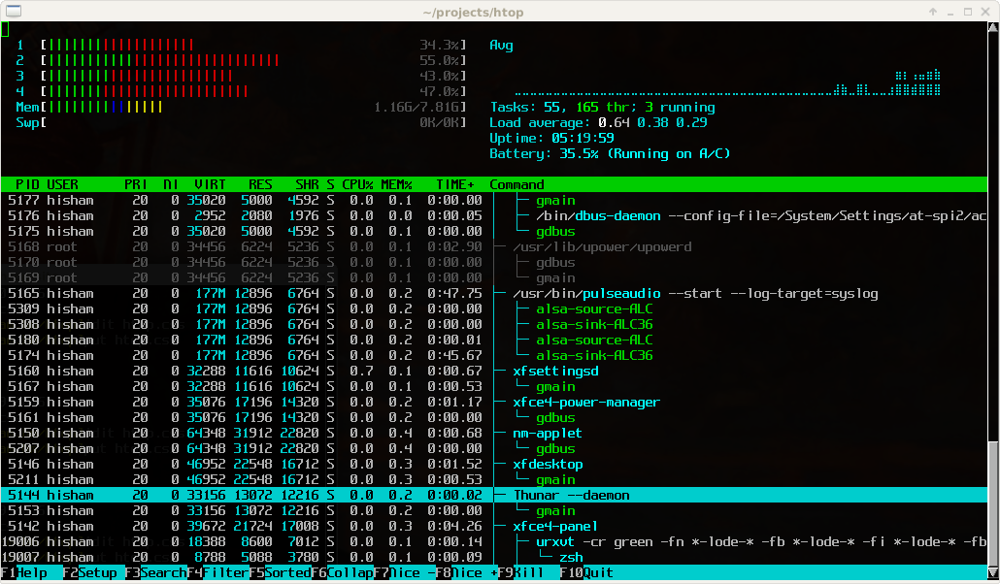

# htop

> **[htop](https://htop.dev) - top 命令的升级款**

`htop` 是一款运行于 `Linux` 系统监控与进程管理软件，用于取代 `Unix` 下传统的 `top`。与 `top` 只提供最消耗资源的进程列表不同，`htop` 提供所有进程的列表，并且使用彩色标识出处理器、`swap` 和内存状态。

- **启动快速块**
- **支持鼠标操作**
- **杀进程时不需要输入进程号**
- **可以横向或纵向滚动浏览进程列表**



```bash
# 安装对应工具
$ brew install htop # macOS
$ sudo apt-get install htop # Ubuntu

# 添加配置别名(.zshrc)
alias top="htop"
```

```bash
# 帮助信息
➜ htop --help
htop 3.1.1
(C) 2004-2019 Hisham Muhammad. (C) 2020-2021 htop dev team.
Released under the GNU GPLv2+.

-C --no-color                   Use a monochrome color scheme
-d --delay=DELAY                Set the delay between updates, in tenths of seconds
-F --filter=FILTER              Show only the commands matching the given filter
-h --help                       Print this help screen
-H --highlight-changes[=DELAY]  Highlight new and old processes
-M --no-mouse                   Disable the mouse
-p --pid=PID[,PID,PID...]       Show only the given PIDs
   --readonly                   Disable all system and process changing features
-s --sort-key=COLUMN            Sort by COLUMN in list view (try --sort-key=help for a list)
-t --tree                       Show the tree view (can be combined with -s)
-u --user[=USERNAME]            Show only processes for a given user (or $USER)
-U --no-unicode                 Do not use unicode but plain ASCII
-V --version                    Print version info

Long options may be passed with a single dash.

Press F1 inside htop for online help.
See 'man htop' for more information.
```
